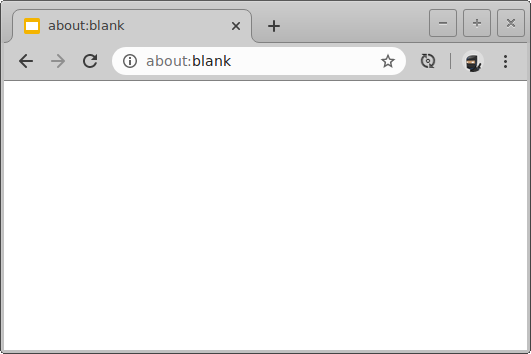

= Neo4j Training Courses
:uri-livereload-webstore: https://chrome.google.com/webstore/detail/livereload/jnihajbhpnppcggbcgedagnkighmdlei?hl=fr
:uri-livereload: http://livereload.com/
:uri-gradle-wrapper: https://docs.gradle.org/current/userguide/gradle_wrapper.html
:uri-java-download: https://www.java.com/fr/download/

image:https://github.com/mogztter/neo4j-training/workflows/CI/badge.svg[GitHub Actions Status, link=https://github.com/mogztter/neo4j-training/actions]

== Prerequisites

Since we are using the {uri-gradle-wrapper}[Gradle Wrapper], the only requirement is to have {uri-java-download}[Java] installed.

> A Java version between 8 and 13 is required to execute Gradle. Java 14 and later versions are not yet supported.

https://docs.gradle.org/6.0/release-notes.html

== Using the Gradle Wrapper

On Windows, open a terminal and type:

 $ gradlew.bat

On Linux and macOS, open a terminal and type:

 $ ./gradlew

If you run this command for the first time it will download and install Gradle.
Make sure that you have an unrestricted access to Internet (ie. not behind a corporate proxy).

== Tasks

In the following examples, we are going to use the command `./gradlew`.
If you are using Windows, don't forget to replace `./gradlew` by `gradlew.bat`.

.Convert to HTML
 $ ./gradlew convertOnlineHtml

.Convert to PDF
 $ ./gradlew convertOnlinePdf

.Convert to reveal.js
 $ ./gradlew convertSlides

All the generated files will be available at [.path]_modules/\{moduleName}/build_.

If you want to convert all the files at once, you can use the `convert` task:

 $ ./gradlew convert

You can also run a task on a specific module:

 $ ./gradlew :administration:convertOnlineHtml
 $ ./gradlew :demo:convert

Or multiple tasks:

 $ ./gradlew :introduction:convertOnlinePdf :demo:convertSlides

Gradle will do his best to detect if a task needs to be run again or not.
If you want to force Gradle to execute a task again, you can remove the `build` directory using the `clean` task:

 $ ./gradlew clean

Once the `build` directory is removed, type the task you want to execute.

== Development mode/environment

When converting the online training, you can define the property "env" to "dev" to avoid loading analytics and token validation code in the HTML pages:

 $ ./gradlew :introduction:convertOnlineHtml -Penv=dev

== LiveReload

To enable {uri-livereload}[LiveReload], you will need to install the {uri-livereload-webstore}[LiveReload browser extension] on Chrome.
Once it's done you should have a new icon on the right of your address bar:

Next, you need to open two terminal.
In the first one, type the following command to continuously convert the AsciiDoc source to a reveal.js presentation:

[source,console]
----
$ ./gradlew --continuous :introduction:convertSlides
----

On the second one, type the following command to start the LiveReload server on the [.path]_introduction_ module:

[source,console]
----
$ ./gradlew :introduction:liveReload

> Task :liveReload
Enabling LiveReload at port 35729 for /path/to/modules/introduction/build
----

You're all set!

Now, open Chrome and navigate to the HTML file of your choice, for instance: http://localhost:35729/slides/04_IntroductionToCypherPresentation.html.
Don't forget to enable the LiveReload extension on your browser by clicking on the icon:

Notice that the middle circle is now filled in black.

If you edit the corresponding AsciiDoc source (or resources), and wait a few seconds, your browser will automatically be refreshed with your changes.

[NOTE]
====
Similarly, you can use LiveReload with the online training using:

 $ ./gradlew --continuous :introduction:convertOnlineHtml -Penv=dev
====
